## Тестовое задание на laravel, так же будет на symfony.
запуск проекта
создать проект ларавел, склонить с гита. 

Создать БД

php artisan migrate

php artisan serve

## Скринкаст Tables

GET http://127.0.0.1:8000/api/tables

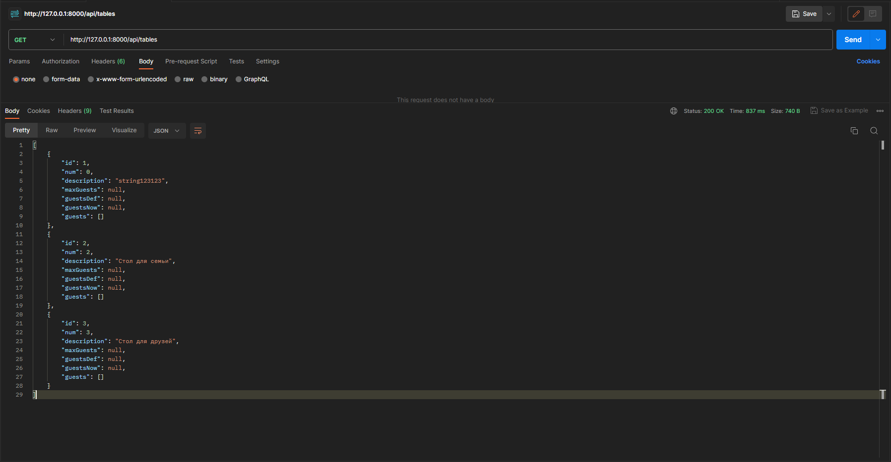

GET http://127.0.0.1:8000/api/tables/{id}

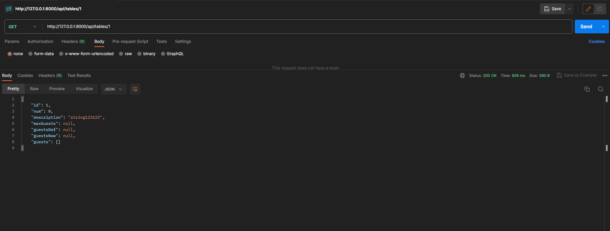

PATCH http://127.0.0.1:8000/api/tables/{id}

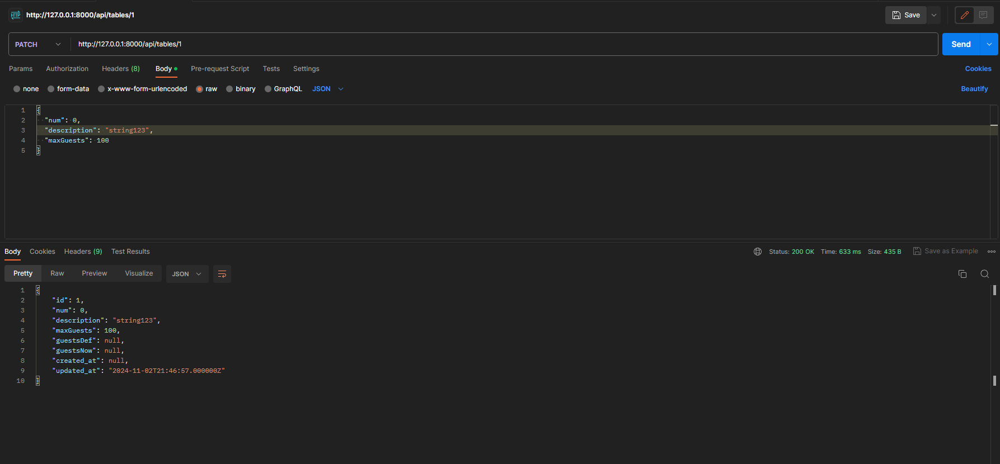

GET http://127.0.0.1:8000/api/tables/{id}/guests

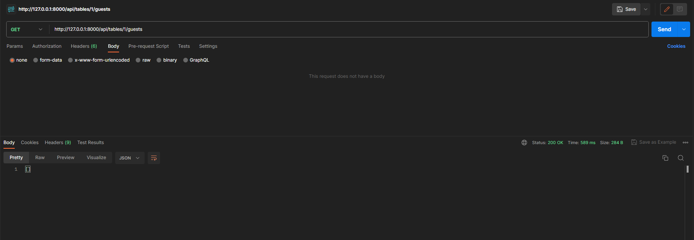

GET http://127.0.0.1:8000/api/tables_stats

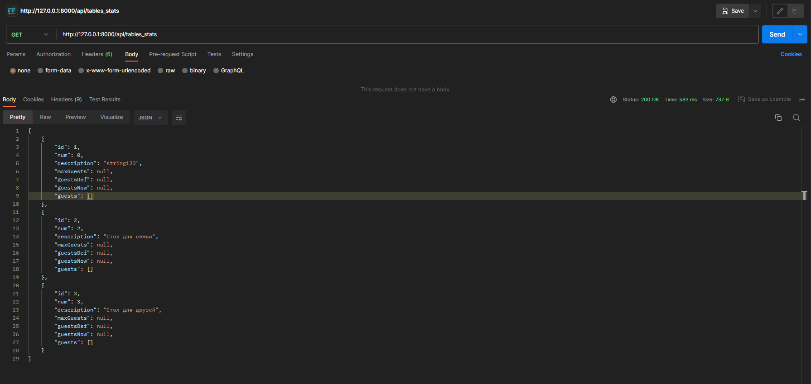

## Скринкаст GuestList

GET http://127.0.0.1:8000/api/guest_lists
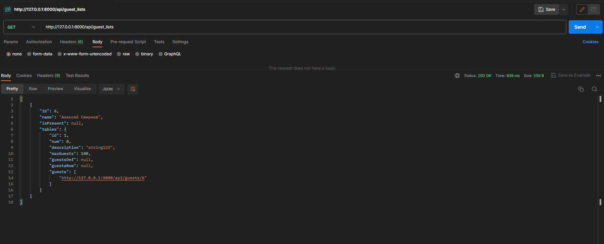

GET http://127.0.0.1:8000/api/guest_lists/{id}
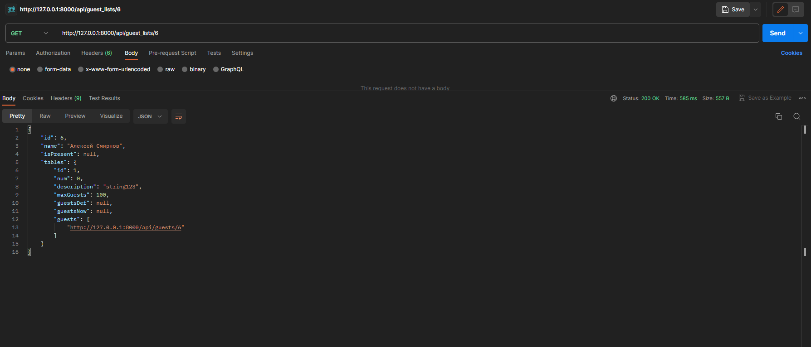

PATCH http://127.0.0.1:8000/api/guest_lists/{id}
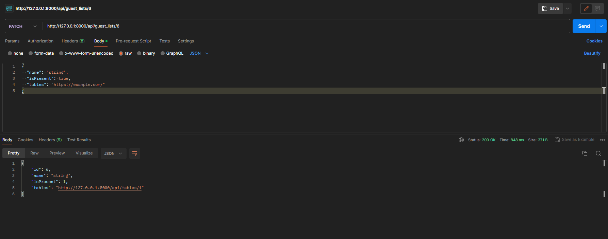

## Дополнительно
POST http://127.0.0.1:8000/api/tables

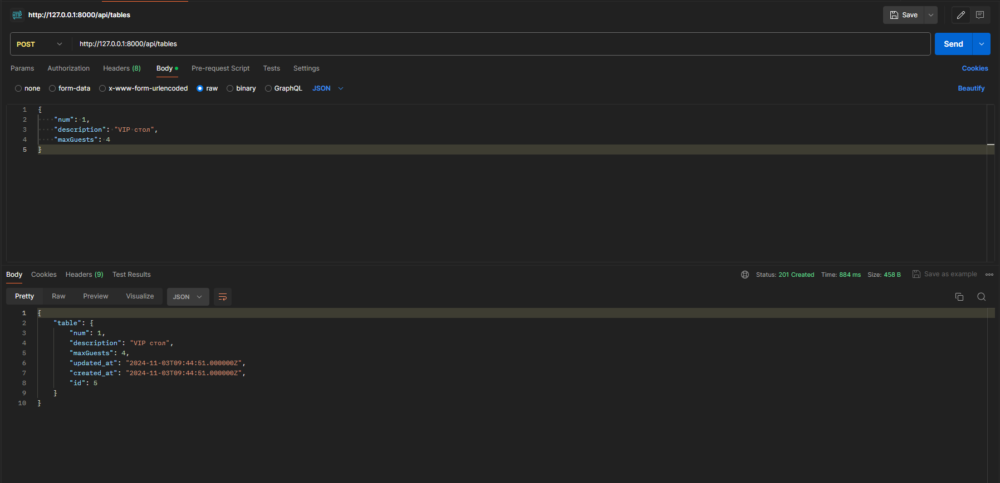

POST http://127.0.0.1:8000/api/guests

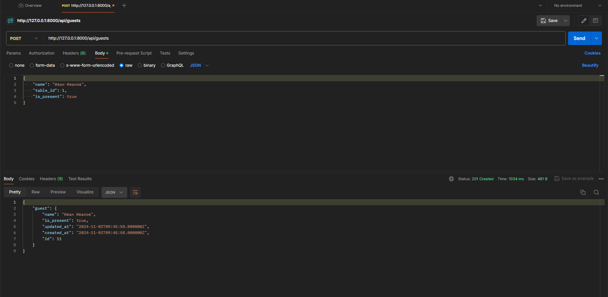

POST http://127.0.0.1:8000/api/login

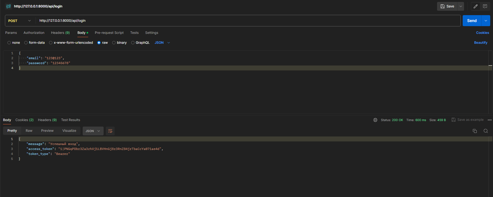